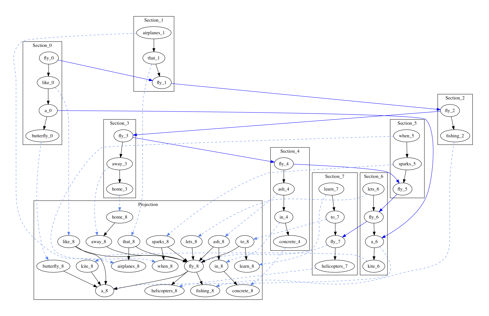
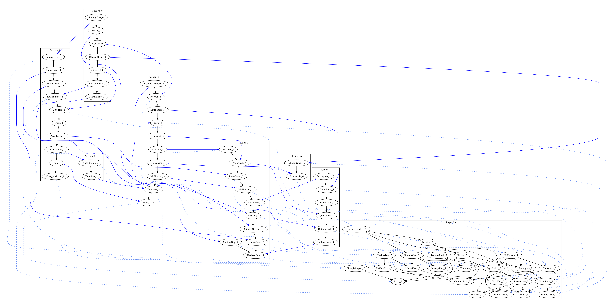

# graph2sheaves
Sheaves library for graph abstractions based on NetworkX

## General
This library, inspired by [1], provides the basic functionality to create sheaves from graphs. The goal is to explore novel algorithms for graph abstraction, summarization, compositionality, and learning.

## Related Work
* PySheaf: Sheaf-theoretic toolbox (https://github.com/kb1dds/pysheaf)

## Sheaves from Text
Consider the following example from [1]. 

```
'fly like a butterfly'
'airplanes that fly'
'fly fishing'
'fly away home'
'fly ash in concrete'
'when sparks fly'
'lets fly a kite'
'learn to fly helicopters'
```

In this example, every sentence represents a section in a sheaf. For every germ (i.e., word) in the sheaf's projection, a stalk is created. The resulting sheaf is shown below. The solid blue lines represent stalks, and the dotted blue lines are the projections of stalks into the base space.




## Sheaves from Singapore Metro (Simplified)
Sections can represent metro lines where germs are the individual stations. The full Singapore MRT lines looks as follows:


The simplified Singapore MRT red, green, blue, purple, and orange lines is:
```
red={Jurong-East, Bishan, Newton, Dhoby-Ghaut, City-Hall, Raffles-Place, Marina-Bay}
green={Jurong-East, Buona-Vista, Outram-Park, Raffles-Place, City-Hall, Bugis, Paya-Lebar, Tanah-Merah, Expo, Changi-Airport}
green2={Tanah-Merah, Tampines}
blue={Botanic-Gardens, Newton, Little-India, Bugis, Promenade, Bayfront, Chinatown, McPherson, Tampines, Expo}
purple={Serangoon, Little-India, Dhoby-Gaut, Chinatown, Outram-Park, HarbourFront}
orange={Marina-Bay, Bayfront, Promenade, Paya-Lebar, McPherson, Serangoon, Bishan, Botanic-Gardens, Buona-Vista, HarbourFront, Marina-Bay}
orange2={Dhoby-Ghaut, Promenade}
```
The resulting sheaf from the simplified Singapore MRT lines is as follows:


## References
[1] Linas Vepstas, "Sheaves: A Topological Approach to Big Data", https://arxiv.org/abs/1901.01341, 2019.  
[2] Justin Michael Curry, "Sheaves, Cosheaves and Applications", https://arxiv.org/pdf/1303.3255.pdf, 2014.
